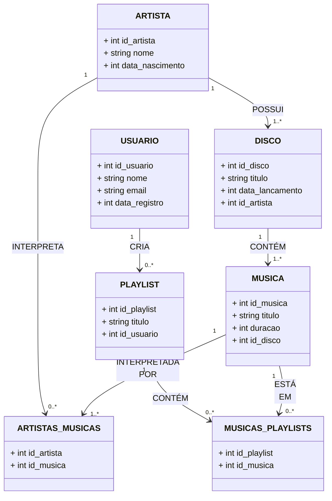

# Sistema de streaming de música

> Status do projeto: Em andamento

> Esse projeto nos foi proposto no 5ºSemestre na disciplina de Banco de Dados

> Escrevemos esse projeto juntos durante as aulas

### Tópicos
🔹[Diagrama Relacional](#straight_ruler-diagrama-relacional)

🔹[Como executar o código](#space_invader-como-executar-o-código)

🔹[Desenvolvedores](#busts_in_silhouette-desenvolvedores)

## :straight_ruler: Diagrama Relacional
### Modelo de Entidade Relacional

   

### Modelo Relacional na 3FN

## :space_invader: Como executar o código
**PRIMEIRO PASSO:** Faça o download do arquivo "criação_de_tabelas.sql" e rode em alguma IDE de banco de dados. Com isso, além de você já criar um database com o nome "projeto1", você também vai criar cada uma das tabelas que os diagramas mostram com os seus atributos.

**SEGUNDO PASSO:** Para colocar os dados nas tabelas que criou no passo anterior. Basta baixar o arquivo com o nome "insercao_dados.sql" e rodar na mesma IDE logo em seguida do passo anterior. 

## :busts_in_silhouette: Desenvolvedores
| [ Mariah Santos Gomes](https://github.com/Mariah-Gomes) | [ Iago Rosa de Oliveira](https://github.com/iagorosa28) |
| :---: | :---: |

### Dados dos desenvolvedores
Iago Rosa de Oliveira 
R.A.: 22.224.027-7

Mariah Santos Gomes 
R.A.: 22.224.026-9
