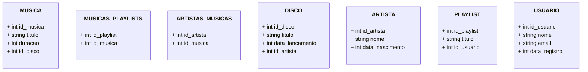

# Sistema de streaming de música

> Status do projeto: Em andamento

> Esse projeto nos foi proposto no 5ºSemestre na disciplina de Banco de Dados

> Escrevemos esse projeto juntos durante as aulas

### Tópicos

🔹[Desenvolvedores](#busts_in_silhouette-desenvolvedores)

## Diagrama Relacional
### Modelo de Entidade Relacional

   

### Modelo Relacional na 3FN

## Como executar o código

## :busts_in_silhouette: Desenvolvedores
| [ Mariah Santos Gomes](https://github.com/Mariah-Gomes) | [ Iago Rosa de Oliveira](https://github.com/iagorosa28) |
| :---: | :---: |
